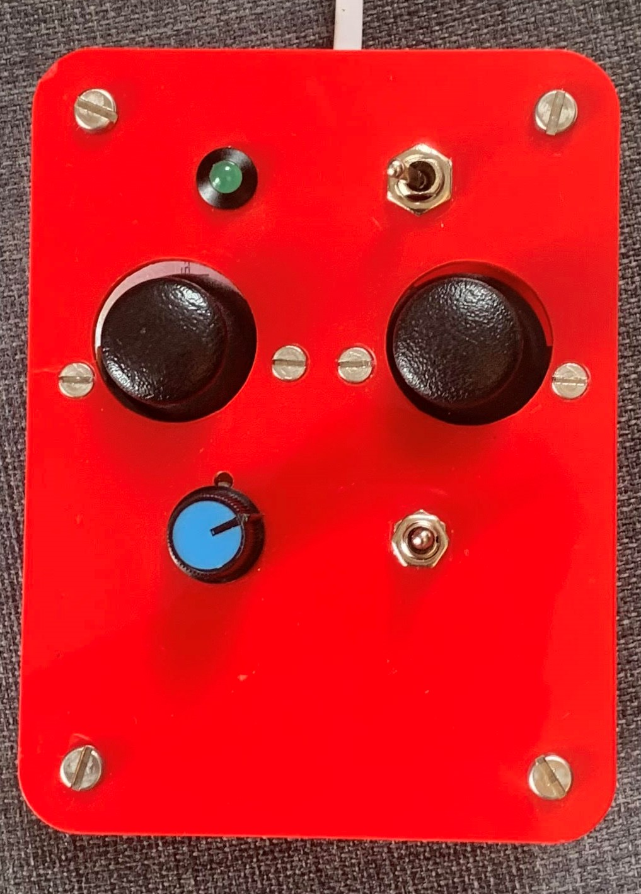
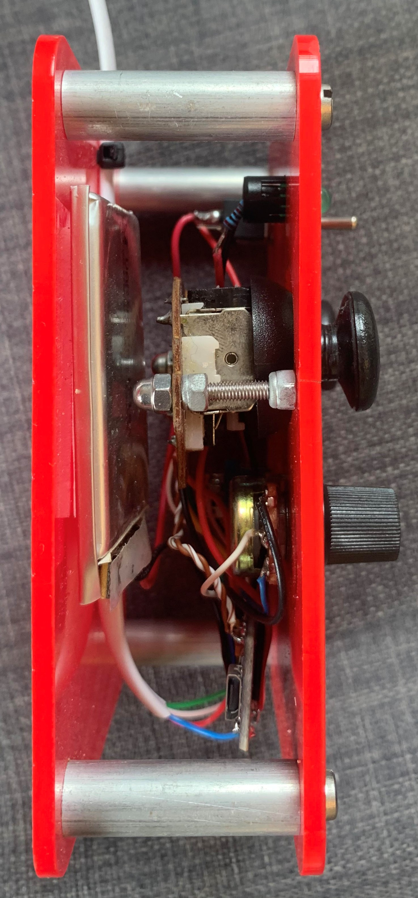

# Rescue-Vehicle-Controller
The serial controller for the Rescue Vehicle
## Outline
This is the code used for the controller of my rescue vehicle. It was a part of my Leaving Certificate Engineering course. 
## Hardware 
The controls consist of two joysticks, a three way switch and a potentiometer. All of these inputs are read by an Arduino pro micro and sent to the Arduino in the rescue vehicle over serial. In the pin layout diagram, I have reserved pins for a nRF24L01 type radio modle to make the setup wireless, however due to the deadline, this was never implemented. 

<table>
  <tr>
      
  </tr>
  <tr>
    
  </tr>
</table>
